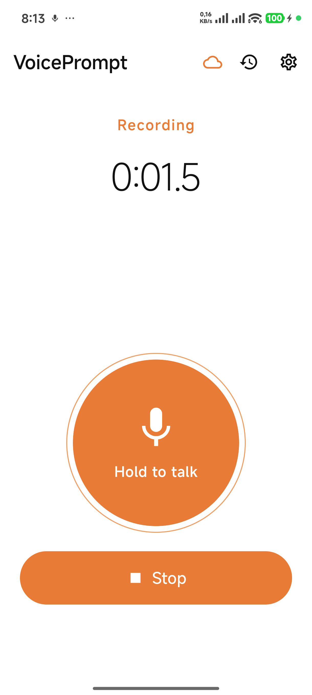
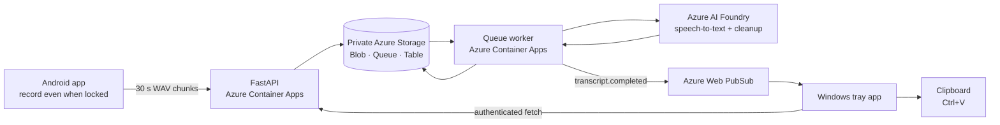

# VoicePrompt

**Think out loud anywhere. Paste a clean prompt on your PC.**

VoicePrompt is a personal voice-to-prompt pipeline for the moments when typing is the
wrong interface. Record a long, unstructured train of thought on Android, let the cloud
transcribe and lightly clean it up, then paste the result from the Windows clipboard into
GitHub Copilot, Copilot, Claude, or any other AI tool.

**Windows dictation:** hold **Ctrl+Alt+Space** while speaking, then release to paste into the
current app. The tiny recording indicator never takes focus; **Esc** cancels. MAI transcribes
short chunks in Azure while you speak, without the Android queue/refinement pipeline.
See the [dictation architecture and operating guide](docs/windows-dictation.md).

## Downloads

Download installers from the [latest GitHub release](https://github.com/tkubica12/cot-voice-recorder/releases/latest):

- [Windows x64 installer](https://github.com/tkubica12/cot-voice-recorder/releases/latest/download/VoicePrompt-Setup.exe)
  (requires .NET 8 Desktop Runtime; not code-signed).
- [Signed Android APK](https://github.com/tkubica12/cot-voice-recorder/releases/latest/download/VoicePrompt-Android.apk)
  (Android 10 or newer).
- [SHA-256 checksums](https://github.com/tkubica12/cot-voice-recorder/releases/latest/download/SHA256SUMS.txt).

The public Windows installer does not bundle local OAuth configuration, tokens or credentials.
Existing configured installations retain their configuration; new installations need the
[Desktop OAuth setup](docs/google-oauth.md). The hosted backend still restricts access to
its configured account allowlist. See the release notes for known dictation limitations.

> **Status:** the complete Android → Azure → Windows flow is live and tested, including
> recording while the phone is locked and automatic delivery to the clipboard.

<p align="center">
  
</p>

## The use case

Preparing a workshop, demo, presentation, or architecture often starts as a messy stream of
ideas rather than a neat document. That stream may take 10–20 minutes, include pauses,
self-corrections, abandoned directions, Czech and English technical terms, and sentences
that only become clear near the end.

Phone dictation can capture the audio, but it does not solve the actual workflow: the result
must reach a desktop AI tool as one usable prompt without manually moving files, waiting for
a giant upload, or cleaning up raw speech.

VoicePrompt makes that handoff deliberately simple:

1. Take out the phone and press **Hold to talk** or **Tap to record**.
2. Lock the phone, put it in a pocket, walk to get coffee, drive, or keep working while talking.
3. Stop the recording when the thought is complete.
4. Return to the PC, open the target Copilot, press <kbd>Ctrl</kbd>+<kbd>V</kbd>, and continue.

The cloud is already transcribing earlier chunks while the user is still speaking. A final
language-model pass fixes obvious transcription errors, technical vocabulary, punctuation,
repetitions, and spoken self-corrections. It intentionally does **not** summarize or invent
content—the next, more capable agent receives the original intent in a cleaner form.

## How it works



| Component | Technology | Responsibility |
|-----------|------------|----------------|
| [`android/`](android/) | Kotlin, Jetpack Compose, Room, WorkManager | Instant two-control capture, foreground recording under screen lock, 30 s chunks with 1.5 s overlap, durable uploads |
| [`backend/`](backend/) | Python 3.13, FastAPI | Authenticated recording API, state machine, chunk ingestion, transcript access |
| [`infra/`](infra/) | Azure Bicep, PowerShell | Container Apps, private Storage, managed identity, Web PubSub, networking, deployment |
| Azure worker | Same Python image, queue-scaled Container App | Chunk transcription, overlap stitching, final language-model cleanup |
| [`windows/`](windows/) | C#, .NET 8, WPF | Background tray listener, automatic clipboard copy, notifications, 48-hour history |

### Processing pipeline

1. Android starts recording immediately; it never waits for a sleeping backend.
2. Audio is stored locally before upload and split into 30-second PCM WAV chunks with a
   1.5-second overlap so words are not clipped at boundaries.
3. Each acknowledged chunk is queued and transcribed independently with
   `MAI-Transcribe-2` through Azure Speech Fast Transcription; its audio is then deleted.
4. After all chunks arrive, the worker stitches and deduplicates their text.
5. `gpt-5.6-luna` performs a conservative cleanup pass over the complete transcript.
6. Web PubSub notifies the Windows tray app, which fetches the final text and copies it to
   the clipboard.

The API contract lives in [`openapi/voice-recorder.yaml`](openapi/voice-recorder.yaml).
The complete state machine, retry semantics, sequence diagram, and security boundaries are
documented in [`docs/architecture.md`](docs/architecture.md).

## Set up your own instance

Nothing is distributed through Google Play or the Microsoft Store. Android is installed as
an APK and Windows through a local per-user installer.

### Prerequisites

- An Azure subscription and an Azure AI Foundry resource with `gpt-5.6-luna`
  (optionally `gpt-5.6-terra` and the `gpt-4o-transcribe` fallback). The deployment
  creates the private Azure Speech resource required by `MAI-Transcribe-2`.
- Azure CLI with permission to create resources and role assignments.
- Python 3.13 and [`uv`](https://docs.astral.sh/uv/) for backend development.
- JDK 17 and Android SDK 35 for the Android build.
- .NET 8 SDK, .NET 8 Desktop Runtime, and Inno Setup 6 for Windows.
- A Google Cloud project with OAuth consent configured.

### 1. Configure Google sign-in

Create three OAuth clients in one Google Cloud project:

| Client | Google application type | Purpose |
|--------|-------------------------|---------|
| Android | Android | Trusts the package name and release signing certificate |
| Web/server | Web application | Audience of Android ID tokens |
| Windows | Desktop application | Authorization Code + PKCE with a loopback redirect |

Download all three client JSON files into a git-ignored `.secrets/` directory, then run:

```powershell
./scripts/Configure-OAuth.ps1 -OwnerEmail you@example.com
```

The script classifies the files and writes only git-ignored local configuration for the
Android build, Azure deployment, and Windows installer. Client IDs, secrets, tokens, and the
allowlisted email are never committed. Follow
[`docs/google-oauth.md`](docs/google-oauth.md) for registration details and release
certificate fingerprints.

For long-lived Windows refresh tokens, publish the OAuth consent screen as **In production**.
The app requests only `openid email profile`; backend access still remains restricted to the
single allowlisted account.

### 2. Deploy Azure

```powershell
cd infra
./deploy.ps1 -LocalParametersFile main.parameters.local.json
```

The idempotent deployment:

1. creates the VNet, private endpoints, DNS zones, Storage, ACR, Web PubSub, managed identity,
   and role assignments;
2. builds the backend image in ACR;
3. deploys the external API, queue-scaled worker, and hourly cleanup job.

The script prints the API URL when complete. Storage public access and shared-key
authentication remain disabled; runtime access uses managed identity. See
[`infra/README.md`](infra/README.md) for parameters, redeployment, and operations.

### 3. Build and install Android

Create and securely back up a stable release keystore as described in
[`android/README.md`](android/README.md), then:

```powershell
cd android
./gradlew.bat :app:assembleRelease --no-watch-fs

$adb = "$env:LOCALAPPDATA\Android\Sdk\platform-tools\adb.exe"
& $adb install -r app\build\outputs\apk\release\app-release.apk
```

On first launch, grant microphone access, open **Settings**, set the deployed API URL if it
differs from the build default, and sign in with the allowlisted Google account.

### 4. Build and install Windows

```powershell
cd windows
dotnet publish src\VoicePrompt.App\VoicePrompt.App.csproj `
    -c Release -r win-x64 --self-contained false -o publish\win-x64

cd installer
& "$env:LOCALAPPDATA\Programs\Inno Setup 6\ISCC.exe" /Q VoicePrompt.iss
.\output\VoicePrompt-Setup.exe
```

The app starts hidden in the notification area. Double-click its tray icon, open
**Settings**, enter the API URL, enable startup if desired, and sign in. The installer is
not code-signed, so Windows SmartScreen may require **More info → Run anyway**.

### 5. Verify the flow

```powershell
curl https://<your-api-host>/health/ready
```

Record a short prompt on Android and stop it. The phone should advance through **Uploading**,
**Transcribing**, **Refining**, and **Completed**. The Windows tray app then shows a
notification and places the cleaned transcript on the clipboard.

## Security and privacy

- Every `/v1` request requires a Google OpenID Connect ID token with a valid issuer,
  signature, expiry, audience, verified email, and exact allowlisted account.
- Azure Storage is private: public network access and shared keys are disabled. Container
  Apps reaches Blob, Queue, and Table through VNet private endpoints and private DNS.
- API, worker, and cleanup job use a shared user-assigned managed identity for Storage,
  Foundry, Web PubSub, and ACR—there are no Azure data-plane keys.
- Audio exists only while needed for processing. Each cloud chunk is deleted immediately
  after transcription; Android deletes its local copy only after server acknowledgement.
- Transcripts and local Windows history expire after 48 hours.
- Realtime notifications contain IDs and a short preview, never the full transcript body.
- The Windows refresh token is encrypted for the current user with DPAPI.

## Development

```powershell
# Backend
cd backend
uv sync --extra dev
uv run pytest --ignore=tests/integration

# Android
cd android
./gradlew.bat :app:testDebugUnitTest --no-watch-fs

# Windows
cd windows
dotnet test VoicePrompt.sln -c Release
```

Component-specific setup, tests, packaging, and troubleshooting:

- [`backend/README.md`](backend/README.md)
- [`android/README.md`](android/README.md)
- [`windows/README.md`](windows/README.md)
- [`infra/README.md`](infra/README.md)

## Repository layout

```text
.
├── android/                       # Native Android capture app
├── backend/                       # FastAPI API, worker, and cleanup command
├── windows/                       # Native Windows tray app and installer
├── infra/                         # Azure Bicep and deployment orchestration
├── openapi/voice-recorder.yaml    # Authoritative API contract
├── docs/architecture.md           # Detailed design and state machine
├── docs/google-oauth.md           # OAuth registration and local config
├── assets/voice-cloud.svg         # Shared application identity
└── scripts/Configure-OAuth.ps1    # Safe local OAuth configuration
```

## License

[MIT](LICENSE) © 2026 Tomáš Kubica.