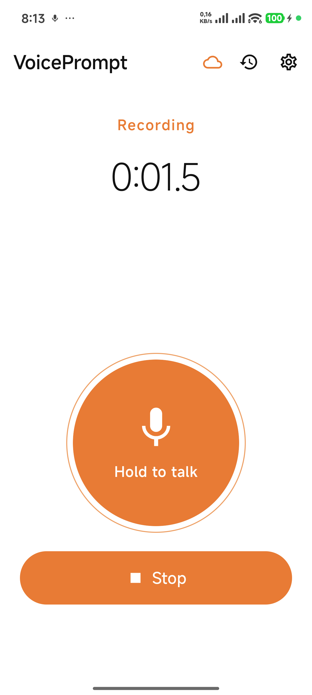
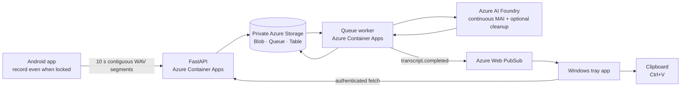

# VoicePrompt

**Think out loud anywhere. Paste a clean prompt on your PC.**

**Latest release: 1.6.0.** Android **1.3.0** adds durable mobile uploads with one
continuous cloud transcription session. Windows remains **1.5.1**, with streaming
dictation, 48-hour cloud audit and immediate overlay hiding after successful paste.
See the [release notes](docs/releases/v1.6.0.md).

**Android 1.3.0:** reliable ten-second uploads feed one continuous cloud
MAI session. Cloud audio is retained for full replay until completion; optional
LLM polishing defaults off. Existing recordings and legacy clients keep their old
pipeline. See [the mobile streaming contract](docs/mobile-streaming.md).

**Windows 1.5.0:** live dictation streams to MAI-Transcribe-2-Streaming through the
Google-authenticated backend; no additional Microsoft login is needed. A provisional
overlay, encrypted local audio checkpoints, reconnect replay and batch Recovery provide
fast feedback without giving up interrupted recordings. Completed dictations upload
original/final text asynchronously for 48-hour cloud audit, without automatic clipboard
notifications. Settings can restore the legacy WAV path. Android is unchanged.
See [streaming, recovery and audit details](docs/windows-dictation.md).

VoicePrompt is a personal voice-to-prompt pipeline for the moments when typing is the
wrong interface. Record a long, unstructured train of thought on Android, let the cloud
transcribe and lightly clean it up, then paste the result from the Windows clipboard into
GitHub Copilot, Copilot, Claude, or any other AI tool.

**Windows dictation:** hold **Ctrl+Alt+Space** while speaking, then release to paste.
Press **Ctrl+Alt+Shift+Space** to start/stop hands-free: switch
windows freely, then focus the intended destination **before stopping**. The non-activating
overlay previews recent words; **Esc** discards. MAI transcribes short chunks in Azure while
you speak. There is no five-minute stop: encrypted local
checkpoints and a **Recovery** tab protect long/interrupted dictations. Recovery never
pastes automatically. Clipboard/History remain the fallback if paste is skipped.
Windows **1.3.1** includes these features and improved overlap-boundary deduplication for
short words such as "to" and "that". It does not remove repetitions inside individual chunks
or use a separate LLM cleanup call.
**New in Windows 1.4.2:** a compact overlay shows only the recording state and three lines
of recent text, without saved/transcribed/pending counters. Settings offers optional
dictation polishing (labeled **Polish dictation with LLM** since 1.4.4), off by default. It cleans small text blocks while you
speak using overlapping text windows spanning multiple audio chunks. Stop sends no new AI
request and does not wait for AI: one final paste combines available edits with the original
ending. Short dictations may remain entirely original; that is not an error. History keeps
both versions with **Copy original**. This requires the updated backend and Windows build.
The current backend uses `gpt-6-luna` for optional Windows dictation polishing; the
Windows setting only switches polishing on or off, while the deployment is configured
centrally with `VR_REFINE_DEPLOYMENT_DEFAULT` on the API.
See the [dictation architecture and operating guide](docs/windows-dictation.md).
**Windows 1.4.3:** optional AI failures no longer show notifications; diagnostics stay
in logs and History. Background cleanup allows 20 seconds on the backend and 25 seconds
in Windows, still with no final AI wait. Storage and paste problems remain visible.

## Downloads

Download installers from the [latest GitHub release](https://github.com/tkubica12/cot-voice-recorder/releases/latest):

- [Windows x64 installer](https://github.com/tkubica12/cot-voice-recorder/releases/latest/download/VoicePrompt-Setup.exe)
  (requires .NET 8 Desktop Runtime; not code-signed).
- [Signed Android APK](https://github.com/tkubica12/cot-voice-recorder/releases/latest/download/VoicePrompt-Android.apk)
  (Android 10 or newer).
- [SHA-256 checksums](https://github.com/tkubica12/cot-voice-recorder/releases/latest/download/SHA256SUMS.txt).

The public Windows installer does not bundle local OAuth configuration, tokens or credentials.
Existing configured installations retain their configuration; new installations need the
[Desktop OAuth setup](docs/google-oauth.md). The hosted backend still restricts access to
its configured account allowlist. See the release notes for known dictation limitations.

> **Status:** the new cloud streaming flow is deployed and synthetically tested through
> automatic Windows clipboard delivery. Earlier Android versions were tested while the
> phone was locked; locked-screen, radio-change and battery checks for Android 1.3.0 still
> require a physical device.

<p align="center">
  
</p>

## The use case

Preparing a workshop, demo, presentation, or architecture often starts as a messy stream of
ideas rather than a neat document. That stream may take 10–20 minutes, include pauses,
self-corrections, abandoned directions, Czech and English technical terms, and sentences
that only become clear near the end.

Phone dictation can capture the audio, but it does not solve the actual workflow: the result
must reach a desktop AI tool as one usable prompt without manually moving files, waiting for
a giant upload, or cleaning up raw speech.

VoicePrompt makes that handoff deliberately simple:

1. Take out the phone and press **Hold to talk** or **Tap to record**.
2. Lock the phone, put it in a pocket, walk to get coffee, drive, or keep working while talking.
3. Stop the recording when the thought is complete.
4. Return to the PC, open the target Copilot, press <kbd>Ctrl</kbd>+<kbd>V</kbd>, and continue.

The cloud transcribes the available contiguous audio while the user is still speaking.
Segment boundaries do not reset the model or create independently recognized text seams.
An optional final language-model pass can clean wording and technical vocabulary; it is
off by default for streaming recordings. The next agent receives the original transcript,
not a summary.

## How it works


```mermaid
flowchart LR
    A["Android app<br/>record even when locked"]
    API["FastAPI<br/>Azure Container Apps"]
    ST[("Private Azure Storage<br/>Blob · Queue · Table")]
    WK["Queue worker<br/>Azure Container Apps"]
    AI["Azure AI Foundry<br/>continuous MAI + optional cleanup"]
    WPS["Azure Web PubSub"]
    W["Windows tray app"]
    C["Clipboard<br/>Ctrl+V"]

    A -->|"10 s contiguous WAV segments"| API
    API --> ST
    ST --> WK
    WK --> AI
    AI --> WK
    WK --> ST
    WK -->|"transcript.completed"| WPS
    WPS --> W
    W -->|"authenticated fetch"| API
    W --> C
```

| Component | Technology | Responsibility |
|-----------|------------|----------------|
| [`android/`](android/) | Kotlin, Jetpack Compose, Room, WorkManager | Instant two-control capture, foreground service, contiguous 10 s segments, durable uploads and provisional preview |
| [`backend/`](backend/) | Python 3.13, FastAPI | Authenticated recording API, state machine, chunk ingestion, transcript access |
| [`infra/`](infra/) | Azure Bicep, PowerShell | Container Apps, private Storage, managed identity, Web PubSub, networking, deployment |
| Azure worker | Same Python image, queue-scaled Container App | Leased continuous MAI session, full replay, optional final polishing; legacy independent STT remains available |
| [`windows/`](windows/) | C#, .NET 8, WPF | Background tray listener, automatic clipboard copy, notifications, 48-hour history |

### Processing pipeline

1. Android starts recording immediately; it never waits for a sleeping backend.
2. New streaming recordings emit contiguous ten-second PCM WAV segments. Each file is
   persisted locally before upload and deleted from the phone only after a cloud ACK.
3. A leased worker sends the ordered PCM prefix to one `MAI-Transcribe-2-Streaming`
   session, without WAV headers, boundary commits or network-gap silence.
4. Cloud audio stays available for full replay after connection/worker failure. The only
   commit happens at known EOF after every declared segment arrives.
5. The canonical raw transcript is finalized directly. `gpt-6-luna` runs only if polishing
   was enabled for that recording. Cloud audio is then removed.
6. Web PubSub notifies the Windows tray app, which fetches the final text and copies it to
   the clipboard.

The API contract lives in [`openapi/voice-recorder.yaml`](openapi/voice-recorder.yaml).
The complete state machine, retry semantics, sequence diagram, and security boundaries are
documented in [`docs/architecture.md`](docs/architecture.md).
Older recordings and the Settings rollback retain the independent 30-second/1.5-second
overlap pipeline. Durable capture protects persisted audio, not incomplete windows or
queued writes lost in a hard process/device failure.

## Set up your own instance

Nothing is distributed through Google Play or the Microsoft Store. Android is installed as
an APK and Windows through a local per-user installer.

### Prerequisites

- An Azure subscription and an Azure AI Foundry resource with
  `MAI-Transcribe-2-Streaming`, plus `gpt-6-luna`
  for optional Android recording refinement and Windows dictation polishing
  (optionally legacy `gpt-5.6-luna` and `gpt-5.6-terra` for existing recordings,
  and the `gpt-4o-transcribe` fallback). The deployment
  creates the private Azure Speech resource required by `MAI-Transcribe-2`.
- Azure CLI with permission to create resources and role assignments.
- Python 3.13 and [`uv`](https://docs.astral.sh/uv/) for backend development.
- JDK 17 and Android SDK 35 for the Android build.
- .NET 8 SDK, .NET 8 Desktop Runtime, and Inno Setup 6 for Windows.
- A Google Cloud project with OAuth consent configured.

### 1. Configure Google sign-in

Create three OAuth clients in one Google Cloud project:

| Client | Google application type | Purpose |
|--------|-------------------------|---------|
| Android | Android | Trusts the package name and release signing certificate |
| Web/server | Web application | Audience of Android ID tokens |
| Windows | Desktop application | Authorization Code + PKCE with a loopback redirect |

Download all three client JSON files into a git-ignored `.secrets/` directory, then run:

```powershell
./scripts/Configure-OAuth.ps1 -OwnerEmail you@example.com
```

The script classifies the files and writes only git-ignored local configuration for the
Android build, Azure deployment, and Windows installer. Client IDs, secrets, tokens, and the
allowlisted email are never committed. Follow
[`docs/google-oauth.md`](docs/google-oauth.md) for registration details and release
certificate fingerprints.

For long-lived Windows refresh tokens, publish the OAuth consent screen as **In production**.
The app requests only `openid email profile`; backend access still remains restricted to the
single allowlisted account.

### 2. Deploy Azure

```powershell
cd infra
./deploy.ps1 -LocalParametersFile main.parameters.local.json
```

The idempotent deployment:

1. creates the VNet, private endpoints, DNS zones, Storage, ACR, Web PubSub, managed identity,
   and role assignments;
2. builds the backend image in ACR;
3. deploys the external API, queue-scaled worker, and hourly cleanup job.

The script prints the API URL when complete. Storage public access and shared-key
authentication remain disabled; runtime access uses managed identity. See
[`infra/README.md`](infra/README.md) for parameters, redeployment, and operations.

### 3. Build and install Android

Create and securely back up a stable release keystore as described in
[`android/README.md`](android/README.md), then:

```powershell
cd android
./gradlew.bat :app:assembleRelease --no-watch-fs

$adb = "$env:LOCALAPPDATA\Android\Sdk\platform-tools\adb.exe"
& $adb install -r app\build\outputs\apk\release\app-release.apk
```

On first launch, grant microphone access, open **Settings**, set the deployed API URL if it
differs from the build default, and sign in with the allowlisted Google account.

### 4. Build and install Windows

```powershell
cd windows
dotnet publish src\VoicePrompt.App\VoicePrompt.App.csproj `
    -c Release -r win-x64 --self-contained false -o publish\win-x64

cd installer
& "$env:LOCALAPPDATA\Programs\Inno Setup 6\ISCC.exe" /Q VoicePrompt.iss
.\output\VoicePrompt-Setup.exe
```

The app starts hidden in the notification area. Double-click its tray icon, open
**Settings**, enter the API URL, enable startup if desired, and sign in. The installer is
not code-signed, so Windows SmartScreen may require **More info → Run anyway**.

### 5. Verify the flow

```powershell
curl https://<your-api-host>/health/ready
```

Record a short prompt on Android and stop it. The phone should advance through **Uploading**,
**Transcribing**, **Refining**, and **Completed**. The Windows tray app then shows a
notification and places the cleaned transcript on the clipboard.
With polishing off, the finalization state may be brief and the clipboard contains the
raw continuous transcript. USB debugging is optional: the signed APK can also be
downloaded on the phone and installed as an update.

## Security and privacy

- Every `/v1` request requires a Google OpenID Connect ID token with a valid issuer,
  signature, expiry, audience, verified email, and exact allowlisted account.
- Azure Storage is private: public network access and shared keys are disabled. Container
  Apps reaches Blob, Queue, and Table through VNet private endpoints and private DNS.
- API, worker, and cleanup job use a shared user-assigned managed identity for Storage,
  Foundry, Web PubSub, and ACR—there are no Azure data-plane keys.
- Audio exists only while needed for processing. Streaming cloud segments survive model
  attempts until final transcript completion; legacy chunks are deleted after individual
  transcription. Android deletes its local copy only after server acknowledgement.
- Transcripts and local Windows history expire after 48 hours.
- Realtime notifications contain IDs and a short preview, never the full transcript body.
- The Windows refresh token is encrypted for the current user with DPAPI.

## Development

```powershell
# Backend
cd backend
uv sync --extra dev
uv run pytest --ignore=tests/integration

# Android
cd android
./gradlew.bat :app:testDebugUnitTest --no-watch-fs

# Windows
cd windows
dotnet test VoicePrompt.sln -c Release
```

Component-specific setup, tests, packaging, and troubleshooting:

- [`backend/README.md`](backend/README.md)
- [`android/README.md`](android/README.md)
- [`windows/README.md`](windows/README.md)
- [`infra/README.md`](infra/README.md)

## Repository layout

```text
.
├── android/                       # Native Android capture app
├── backend/                       # FastAPI API, worker, and cleanup command
├── windows/                       # Native Windows tray app and installer
├── infra/                         # Azure Bicep and deployment orchestration
├── openapi/voice-recorder.yaml    # Authoritative API contract
├── docs/architecture.md           # Detailed design and state machine
├── docs/google-oauth.md           # OAuth registration and local config
├── assets/voice-cloud.svg         # Shared application identity
└── scripts/Configure-OAuth.ps1    # Safe local OAuth configuration
```

## License

[MIT](LICENSE) © 2026 Tomáš Kubica.