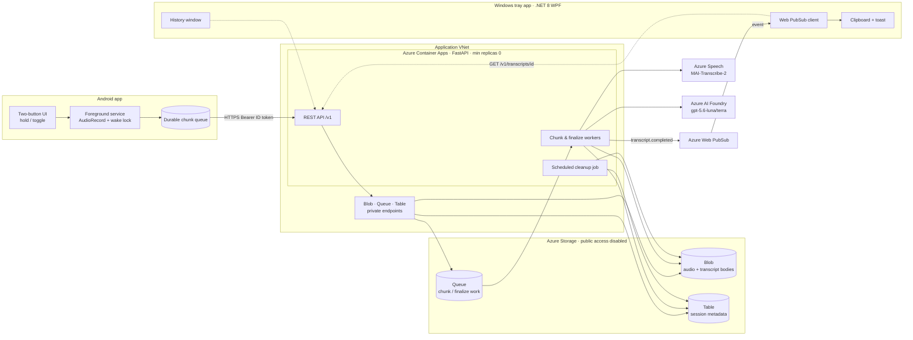
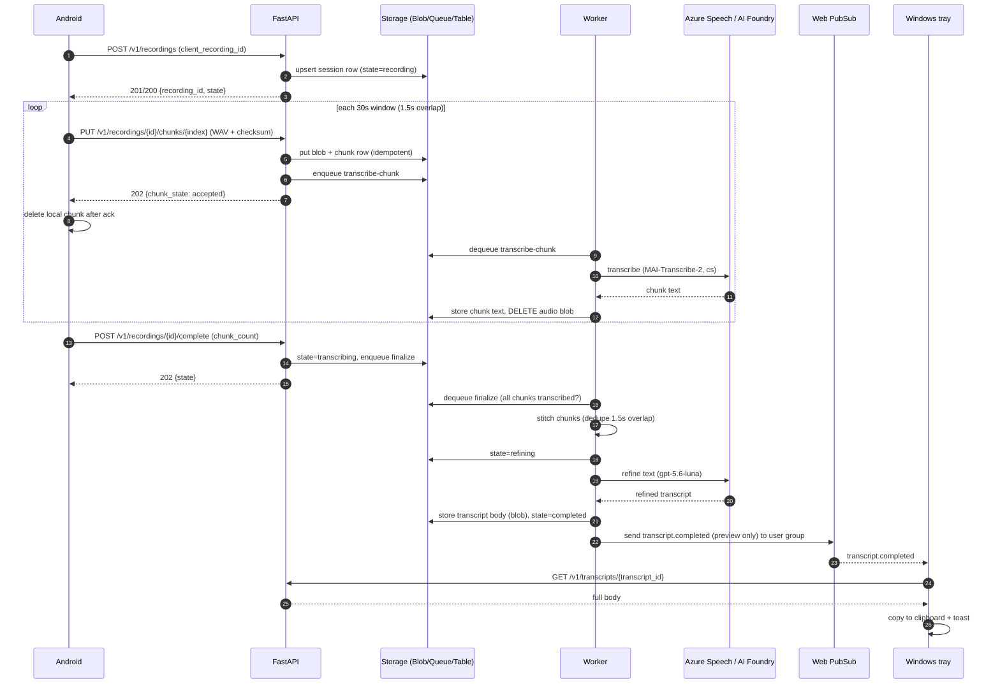
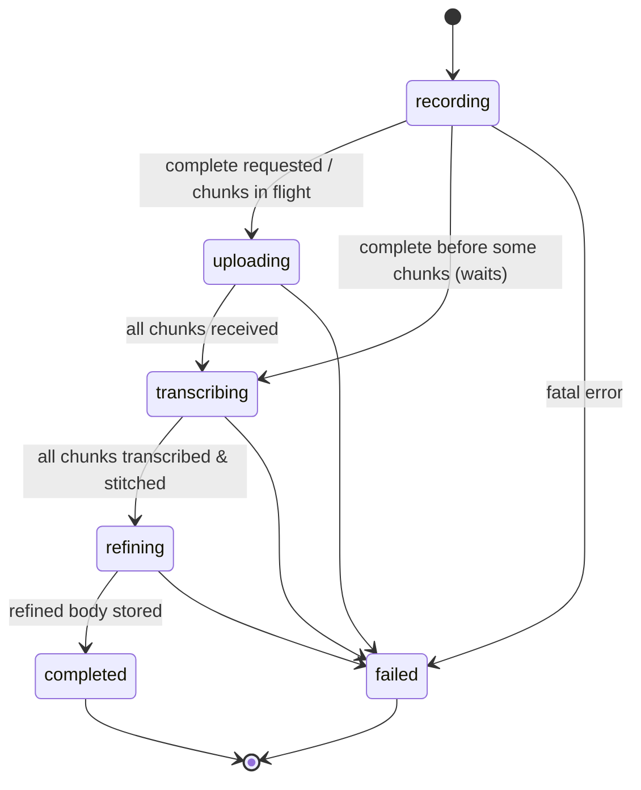
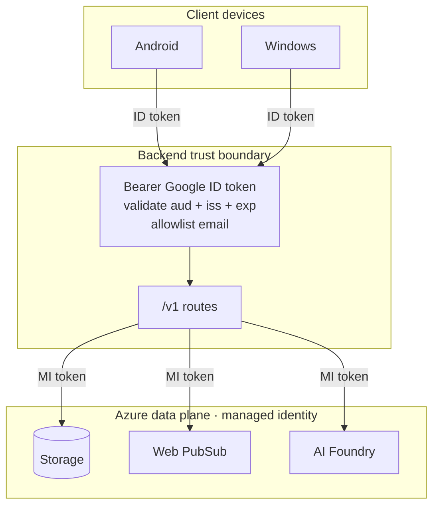

# Architecture

This document describes the end-to-end design of **cot-voice-recorder**: how a spoken
prompt on an Android phone becomes a refined transcript on a Windows clipboard, and the
rules that keep the pipeline correct, private, and cheap.

- **Audience:** implementers of the backend, Android, and Windows components.
- **Contract:** the wire format is defined authoritatively in
  [`../openapi/voice-recorder.yaml`](../openapi/voice-recorder.yaml). This document explains
  *behavior* around that contract; where the two overlap, the OpenAPI file wins for shapes
  and status codes, and this document wins for lifecycle and semantics.

## 1. Goals and constraints

- **Single, authenticated user.** One allowlisted Google account. No multi-tenant concerns,
  but strict auth on every `/v1` route.
- **Perceived latency matters more than throughput.** The Android UI must feel instant;
  actual transcription may take seconds and runs asynchronously.
- **Cheap at rest.** The cloud backend scales to **zero** replicas when idle. Nothing may
  require the backend to be always-on; notifications must not poll it.
- **Privacy-first.** Audio is transient, transcripts are short-lived, and notifications never
  carry private text.
- **No keys in the data plane.** Azure data-plane access uses **managed identity** only.
- **No public Storage data plane.** Storage public network access and shared-key
  authentication are disabled. Blob, Queue, and Table are reachable only through private
  endpoints from the Container Apps virtual network.

## 2. Component map

## 3. End-to-end flow

### 3.1 Happy path (sequence)

### 3.2 Cold start

Container Apps may be at **zero replicas** when the user hits record. The client design
tolerates this:

- `POST /v1/recordings` is created **asynchronously** on the Android side: the UI starts
  capturing immediately and enqueues the create request. The user never waits on the network.
- Chunk uploads retry with backoff against a durable local queue; the first request simply
  absorbs the cold-start latency.
- Because create and chunk upload are **idempotent**, retries during cold start cannot create
  duplicates or corrupt ordering.
- The ID token can expire while uploads are queued. Background workers first use a valid cached
  token and otherwise leave the step retryable while a notification asks the user to sign in.
  Credential Manager is Activity-only because its provider can show a chooser even when
  auto-select is requested; background code therefore never calls it or launches UI.
- Local audio is durable *before* it is uploaded, and it stays durable: a mid-recording capture
  error preserves every persisted chunk, schedules its upload and declares the real chunk count.
  Local data is deleted only on an explicit user cancel or when nothing was ever persisted.

## 4. State machine

A recording moves through these states (see `RecordingState` in the OpenAPI file):

Semantics:

- **recording** — session exists; chunks may still arrive. Set on create.
- **uploading** — `complete` has been requested and the backend is waiting for the declared
  `chunk_count` chunks to finish arriving. Distinguishes "user stopped" from "still capturing".
- **transcribing** — all expected chunks are present; per-chunk transcription is running or
  finishing.
- **refining** — chunk texts are stitched and the refinement model is cleaning the text.
- **completed** — final transcript body is stored and a `transcript.completed` event was sent.
- **failed** — terminal error (e.g., missing chunks after grace period, model failure after
  retries). Carries a `failure_reason`.

`progress` (received / expected chunk counts, transcribed count) is exposed on
`GET /v1/recordings/{id}` so the client can show status without WebSocket access.

## 5. Idempotency & retry rules

Every mutating operation is safe to retry. This is essential because the Android durable queue
retries aggressively and the backend can cold-start mid-request.

| Operation | Idempotency key | Retry behavior |
|-----------|-----------------|----------------|
| `POST /v1/recordings` | `client_recording_id` (client-generated UUID) | Same key returns the same `recording_id`. First call → `201`, subsequent → `200`. Different `client_recording_id` → new recording. |
| `PUT .../chunks/{index}` | `(recording_id, index)` + content `checksum` | Re-uploading the same index with the same checksum → `200` (already accepted), no duplicate work. Same index, **different** checksum → `409 Conflict` (client bug / corruption). |
| `POST .../complete` | `(recording_id, chunk_count)` | Re-calling with the same `chunk_count` is a no-op returning current state. Different `chunk_count` after the first accepted complete → `409`. |
| Queue messages (transcribe/finalize) | message dedup on `(recording_id, index)` / `(recording_id, "finalize")` | At-least-once delivery; workers are idempotent — transcribing an already-transcribed chunk is skipped; finalize re-runs only if not `completed`. |

### 5.1 Complete / chunk race

`complete` may arrive **before** the last chunk, or a late chunk may arrive **after**
`complete`:

- `complete` records the **expected** `chunk_count` and moves the session to `uploading`
  (not `transcribing`) until exactly `chunk_count` distinct indices are present.
- A chunk arriving after `complete` with an index `< chunk_count` is accepted normally.
- A chunk with index `>= chunk_count` after `complete` → `409` (client declared fewer chunks
  than it sent; indicates a client bug).
- If the declared chunks do not all arrive within a bounded grace window, the finalize worker
  marks the session `failed` with `failure_reason = "missing_chunks"`.

### 5.2 Transcription & refinement retries

- Chunk transcription retries with exponential backoff up to a bounded attempt count; the
  audio blob is retained until a chunk **succeeds**, then deleted immediately. On terminal
  failure the chunk (and recording) go `failed` and the audio is still deleted per retention.
- Refinement retries similarly; the stitched raw text is preserved in Table/Blob so a retry
  does not need audio.

### 5.3 Queue leasing & worker resilience

- The worker receives **one message at a time** (`VR_QUEUE_BATCH_SIZE=1`). Processing is
  sequential, so a larger batch would let the visibility lease of the last message in the
  batch expire while the first is still waiting on Foundry — the message would be
  redelivered to another replica and the model call duplicated.
- The processing lease is `VR_QUEUE_VISIBILITY_SECONDS` (default **300 s**), sized to
  comfortably exceed the slowest Foundry transcription/refinement round-trip.
- Retry backoff is a separate knob, `VR_QUEUE_RETRY_BASE_SECONDS` (default 30 s, doubling
  per dequeue up to 600 s): the lease sizes one attempt, the backoff sizes the wait
  between attempts.
- The worker loop survives queue-level faults. A `receive` failure is logged with
  structured metadata (never payload) and retried after an interruptible backoff that
  still honours SIGTERM. A failed `delete` or a stale/expired pop receipt on `renew` is
  logged and tolerated: the message is simply redelivered, and both `transcribe` and
  `finalize` are idempotent.

### 5.4 Finalize durability

`finalize_enqueued` is a reservation flag persisted with optimistic concurrency **before**
the finalize message is sent, so concurrent triggers cannot both enqueue. If the send then
fails, the flag is rolled back and the error is re-raised, so the caller retries. Every
`POST /complete` — including an idempotent replay that returns `200` — re-arms finalize or
the grace watchdog before answering, so a recording whose finalize message was never
successfully enqueued is repaired by the client's normal retry. Duplicate finalize
messages are harmless because `finalize` runs only while the recording is not yet
`completed`.

## 6. Security boundaries

- **Inbound auth.** All `/v1` routes require an `Authorization: Bearer <Google ID token>`.
  The backend validates signature (Google JWKS), `iss`, `exp`, and that `aud` is one of the
  configured Google client IDs (Android + Windows), and that `email` matches the single
  allowlisted address (and `email_verified` is true). Failures return
  `401` (missing/invalid token) or `403` (valid token, not allowlisted).
- **Health probes** `GET /health/live` and `GET /health/ready` are unauthenticated and expose
  no user data.
- **Outbound auth.** The backend holds **no keys**. It uses a shared **user-assigned
  managed identity** (its client id supplied via `AZURE_CLIENT_ID` for
  `DefaultAzureCredential`) to obtain tokens for Storage (Blob/Queue/Table data-plane
  roles), Web PubSub (to mint client URIs and send events), Azure AI Foundry (Cognitive
  Services user role), and ACR image pull. The same identity is shared by all three
  runtime components so RBAC, ACR pull, and KEDA queue authorization are pre-created and
  deterministic. Those components are **three separate Azure Container Apps resources**:
  the external-ingress **API** app (HTTP scale-to-zero), a no-ingress **worker** app
  scaled from zero on the private Storage queue via managed identity, and a **scheduled
  cleanup job** that runs hourly — rather than running API and worker in one process.
- **Private Storage networking.** The external-ingress Container Apps environment is injected
  into a dedicated infrastructure subnet. A separate subnet hosts private endpoints for the
  Storage `blob`, `queue`, and `table` subresources. The VNet is linked to
  `privatelink.blob.core.windows.net`, `privatelink.queue.core.windows.net`, and
  `privatelink.table.core.windows.net` private DNS zones so SDK calls to the normal Storage
  host names resolve privately. Storage sets `publicNetworkAccess: Disabled`,
  `defaultAction: Deny`, and `allowSharedKeyAccess: false`.
- **Network separation.** Client traffic still enters the authenticated public HTTPS endpoint
  of the Container App; clients never receive Storage URLs or credentials. The private-endpoint
  subnet is distinct from the Container Apps delegated subnet and disables private-endpoint
  network policies as required by Azure.
- **Web PubSub scoping.** `POST /v1/realtime/negotiate` returns a **user-scoped** client
  access URI (joined to the single user's group with only the `transcript.completed` event
  type). The client connects directly; the backend never has to stay awake to relay.
- **Notification minimization.** Events contain IDs, timestamp, and a short preview; the full
  transcript is only retrievable via an authenticated `GET`.

## 7. Data lifecycle & storage design

| Data | Store | Lifetime |
|------|-------|----------|
| Audio WAV chunk | Blob (`audio/{recording_id}/{index}.wav`) | Deleted **immediately** after the chunk is transcribed (success or terminal failure). |
| Session metadata (state, progress, chunk rows) | Table | 48 hours after completion/failure, then cleaned. |
| Stitched raw text | Blob/Table (internal) | Retained with the session (48 h) to enable refinement retries. |
| Final transcript body | Blob (`transcript/{transcript_id}.txt`) | 48 hours, then deleted. |
| Queue messages | Queue | Consumed then deleted; poison messages dead-lettered. |

- **Primary deletion is inline** (right after transcription / at retention expiry).
- **Scheduled cleanup job** runs periodically as a *safety net*: it deletes audio blobs whose
  session no longer needs them, and any session/transcript older than 48 hours that inline
  paths missed. It is idempotent and safe to run at any time.
- Blob lifecycle management policies are a secondary backstop but are not relied upon for the
  privacy guarantee (their granularity is coarse).

## 8. Model choice rationale

- **Transcription — `MAI-Transcribe-2` via Azure Speech Fast Transcription API
  `2025-10-15`.** Chosen after live Czech comparison against `gpt-4o-transcribe`: the
  models produced the same mean word-error rate on clean, self-correction, code-switching,
  and 12 dB noisy samples, while MAI verbatim completed about twice as fast. It runs in a
  private North Europe `AIServices` resource because Sweden Central does not currently
  support MAI transcription. `gpt-4o-transcribe` remains a configurable fallback.
  MAI-Transcribe-2 is currently an Azure public-preview feature without an SLA.
- **Refinement (default) — `gpt-5.6-luna` (2026-07-09).** Cleans up disfluencies, fixes
  punctuation/casing, and stitches overlap seams into coherent prose while preserving meaning.
  Default because it balances quality and cost for short prompts.
- **Refinement (alternative) — `gpt-5.6-terra` (2026-07-09).** Configurable per request/session
  for cases needing a different quality/latency tradeoff. The API exposes a `refine_model`
  selector constrained to the allowed set.
- **Why two stages.** Transcription is specialized and cheap per chunk; refinement benefits
  from full context after stitching. Separating them lets each retry independently and keeps
  audio deletable as soon as raw text exists.
- **Overlap handling.** 1.5 s overlap between 30 s windows avoids clipping words at boundaries;
  the stitch step dedupes the overlap using the transcribed text (and timing hints) before
  refinement.

## 9. Notification path

- The backend sends `transcript.completed` to the user's Web PubSub group after the final body
  is stored. The event schema (see `TranscriptCompletedEvent` in the OpenAPI file):
  - `event` = `"transcript.completed"`, unique `event_id` (UUID) for client dedup,
  - `transcript_id`, `recording_id`,
  - `completed_at` (ISO 8601), and a short `preview` (bounded length),
  - **no full transcript body.**
- The Windows tray app maintains a persistent Web PubSub connection (renewing its access URI
  via `negotiate` as needed), dedupes on `event_id`, then fetches the body and copies it to the
  clipboard with a toast. Android may also subscribe for in-app confirmation.
- This path means the backend can be at **zero replicas** between recordings: the client is
  woken by Web PubSub, and only then makes a single authenticated fetch that cold-starts the
  backend if necessary.

## 10. Tradeoffs & alternatives considered

- **Scale-to-zero vs. latency.** We accept occasional cold-start latency (absorbed by async
  create + durable retry) in exchange for near-zero idle cost. A min-replica-1 backend would be
  simpler but costlier and unnecessary for one user.
- **Web PubSub vs. polling.** Direct client Web PubSub avoids the tray app polling (which would
  keep the backend warm and drain battery). Cost is an extra managed service and a negotiate
  round-trip.
- **Chunked upload vs. single-file.** Chunking gives fast perceived completion, bounded memory,
  progressive transcription, and resumability, at the cost of stitch complexity and overlap
  dedup.
- **Two-model pipeline vs. single model.** Two stages add orchestration but allow immediate
  audio deletion and independent retries; a single multimodal call would hold audio longer and
  couple failure modes.
- **Table storage vs. a database.** Table storage is sufficient for single-user session
  metadata and is cheap/serverless; a relational DB would add operational weight for no benefit
  here.
- **Private endpoints vs. service endpoints.** Private endpoints are used for all three Storage
  data services because subscription policy disallows public access. This adds DNS and subnet
  resources but gives deterministic private routing and keeps the Storage firewall closed.
- **48 h retention.** Long enough to recover a missed clipboard, short enough to minimize data
  at rest. Enforced by inline deletion plus a scheduled net.

## 11. Testing strategy

| Layer | Scope | Tooling |
|-------|-------|---------|
| Backend unit | Auth validation, state machine transitions, idempotency keys, stitch/dedup logic, Problem Details shaping | pytest |
| Backend integration | Blob/Queue/Table interactions, worker flows, cleanup job | pytest + **Azurite** |
| Android JVM | Chunking math (window/overlap), durable queue, retry/backoff, ack-then-delete | JUnit / Robolectric |
| Android instrumented | Foreground service + AudioRecord capture, permission & wake-lock behavior | Android emulator tests |
| Windows unit | Web PubSub event handling, dedup, DPAPI token store, 48 h cache expiry, clipboard/history logic | xUnit |
| API contract | Requests/responses conform to `openapi/voice-recorder.yaml` (both directions) | schema-driven contract tests |
| Azure smoke (later) | Real Container Apps + Storage + Web PubSub + Foundry, managed identity, end-to-end | scripted smoke run |

Contract tests are the glue: each component validates its I/O against the shared OpenAPI file
so client and backend can be built independently and still interoperate.

## 12. Open questions / future work

- Grace-window duration for `missing_chunks` before failing a recording (tune from real usage).
- Whether Android should also copy the transcript locally (parity with Windows) — currently
  Windows is the primary sink.
- Per-session language override (currently Czech-first) if other languages are needed.
